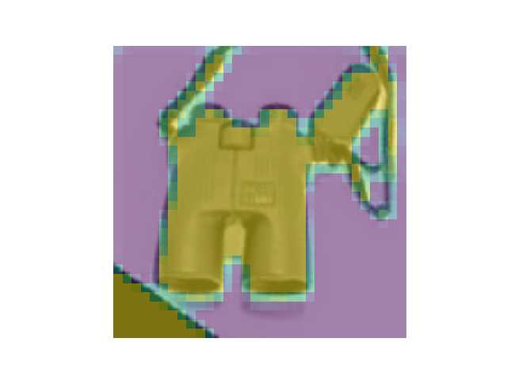
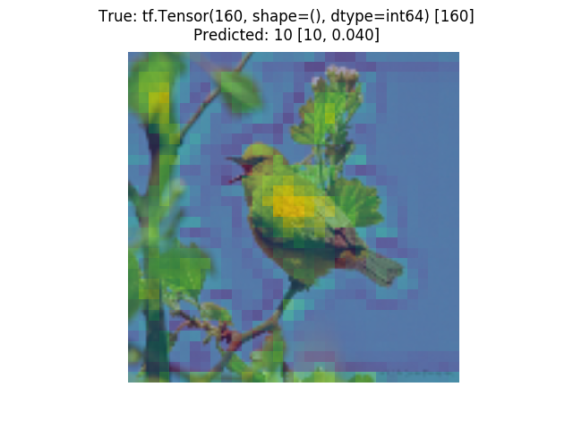
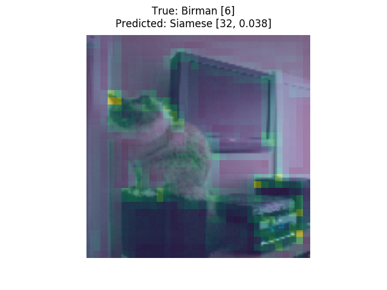
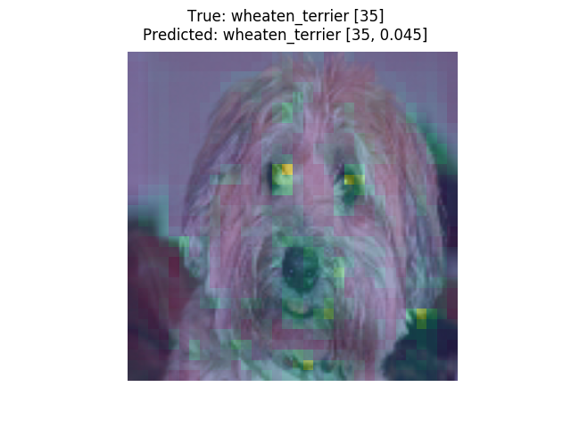
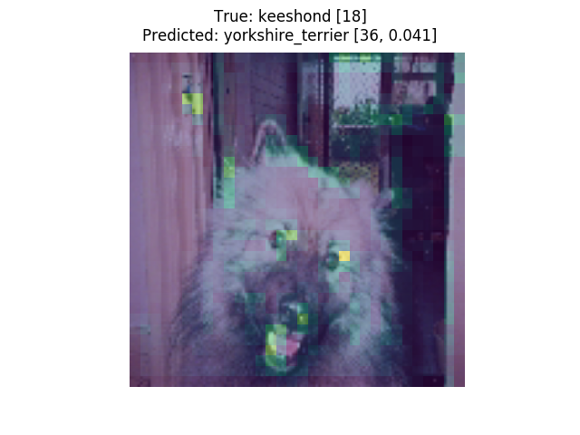
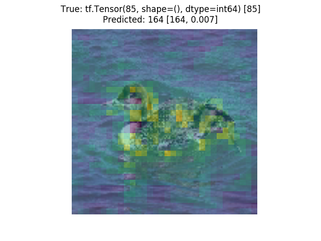
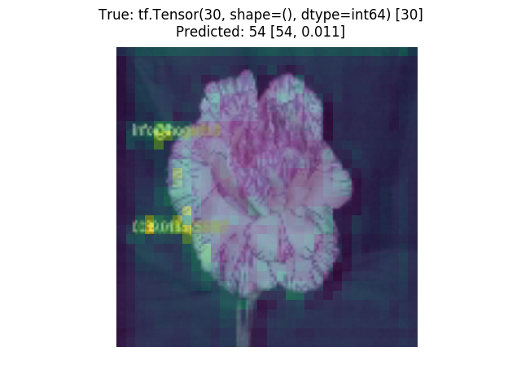

# universal_attention
I was curious to see whether neural networks could learn _task-independent_ visual attention -- how to pick out what's imporant in a scene without necessarily knowing what it is.
This repository contains the code for models and experiments I used to play around with this idea.
Written for the final project of Caltech's CNS186 (Vision) class.

<div class="row">




</div>
<div class="row">




</div>

## Intuition
Some things are a lot more salient to humans than others, just by their visual characteristics (bright colors, sharp contrasts, ...).
It's often possible to pick out objects from background without knowing too much about the objects themselves.
Therefore "universal attention" seems learnable.

Hopefully once the network has a good sense of where things are in an image, it can use that to learn faster, since cutting out a lot of noise background pixels should give the network a cleaner signal to train on.

## How it works
I train a variant of ResNet50 with attention [(Jetley et al. 2018)](https://openreview.net/forum?id=HyzbhfWRW) and see what the model learns to focus on.
In order (hopefully) to learn a broad notion of what's interesting in an image, I meta-train the network with Reptile [(Nichol et al. 2018)](https://openai.com/blog/reptile/) on six datasets:
 - [ibean](https://github.com/AI-Lab-Makerere/ibean/)
 - [Caltech-UCSD Birds 200-2011](http://www.vision.caltech.edu/visipedia/CUB-200-2011.html)
 - [Imagenette](https://github.com/fastai/imagenette)
 - [Stanford Dogs](http://vision.stanford.edu/aditya86/ImageNetDogs/main.html)
 - [Stanford-IIIT Pets](http://www.robots.ox.ac.uk/~vgg/data/pets/)
 - [Oxford Flowers 102](https://www.robots.ox.ac.uk/~vgg/data/flowers/102/)

Then, to see if knowing where things are helps the network learn what they are, I evaluate by transfer-learning the model to [Caltech101](http://www.vision.caltech.edu/Image_Datasets/Caltech101/).

## Running the code
This project manages dependencies through [Pipenv](https://github.com/pypa/pipenv).
To install dependencies, run `pipenv install` from the project directory.

Then, the project can be operated through the three executable scripts under `scripts/`:
 - `run_reptile_experiment.py` runs a single experiment with manually picked hyperparameters.
 - `train_target.py` evaluates an existing checkpoint on the target task (Caltech101).
 - `hyperopt_attention.py` runs hyperparameter optimization code using [Hyperopt](https://github.com/hyperopt/hyperopt).

Scripts are run through Pipenv like `pipenv run python scripts/some_script.py --run_name=my_run --other_flag=something_else`.

All three scripts are configured with command-line flags; run `scripts/some_script.py --helpfull` to see the full list.
They dump their logs in `--tb_log_dir` (default: outputs/logs) and checkpoints in `--checkpoint_dir` (default: outputs/checkpoints).

## Project structure
```
├── data/: Default download / usage directory for all data.
├── outputs/
│   ├── checkpoints/: Default directory to save checkpoints in.
│   └── logs/: Default directory to save TensorBoard logs in.
├── images/: Examples of the meta-learned model's attention maps.
├── scripts/
│   ├── hyperopt_attention.py: Run hyperparameter optimization with HyperOpt.
│   ├── run_reptile_experiment.py: Run the meta-training --> evaluation pipeline.
│   └── train_target.py: Evaluate a pre-trained checkpoint on the target dataset.
└── universal_attention/: Holds project source code.
    └── ...
```
